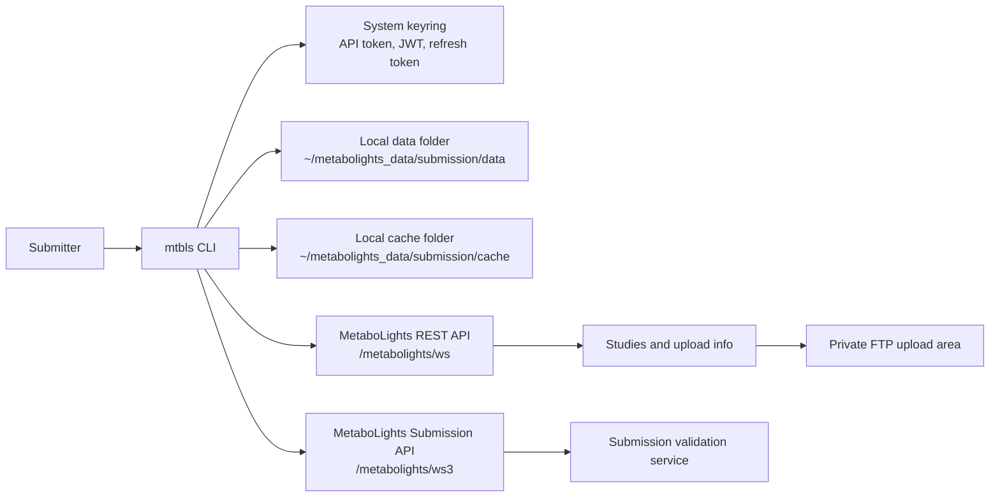

# mtblspy

`mtblspy` is a Python command-line client for the MetaboLights study submission workflow. It helps submitters authenticate, create provisional studies, manage study metadata, run validation, download validation reports as JSON, and retrieve private FTP credentials.

The installed command is:

```bash
mtbls
```

## What It Does

`mtblspy` focuses on the private submission workflow for MetaboLights:

| Area | Supported actions |
| --- | --- |
| Authentication | Login, logout, store API/JWT credentials in the system keyring |
| Configuration | Show effective runtime configuration |
| Study creation | Generate a study creation JSON template and create a provisional study |
| Study management | List studies created by the authenticated user |
| Metadata upload | Upload ISA-Tab metadata files for a study |
| Validation | Run remote API validation or local validation with the MetaboLights validation bundle |
| Data upload | Retrieve private FTP credentials for study data upload |

## Infrastructure View



`mtblspy` runs locally. It stores reusable credentials in the operating system keyring and writes generated JSON files to local data/cache directories unless an explicit output path is provided.

## Installation

### From Source

```bash
git clone https://github.com/EBI-Metabolights/mtblspy.git
cd mtblspy
uv sync
uv run mtbls --help
```

For an editable developer install:

```bash
uv sync --dev
uv run pytest
```

### Python Package Entry Point

The package exposes this console script:

```toml
mtbls = "mtblspy.commands.cli:cli"
```

After installing the package into an environment, use `mtbls` directly.

## Authentication

Login with your MetaboLights username or email and password:

```bash
mtbls auth login --user user@example.org --password "your-password"
```

If values are omitted, the CLI prompts for them:

```bash
mtbls auth login
```

By default, the CLI uses:

```text
https://www.ebi.ac.uk/metabolights/ws
```

To use another MetaboLights REST API base URL, save it once:

```bash
mtbls config set --base-url https://wwwdev.ebi.ac.uk/metabolights/ws
```

Then login without repeating the base URL:

```bash
mtbls auth login --user user@example.org --password "your-password"
```

You can still override the configured value for a single login:

```bash
mtbls auth login \
  --user user@example.org \
  --password "your-password" \
  --base-url https://wwwdev.ebi.ac.uk/metabolights/ws
```

Environment variables can also provide credentials/configuration:

| Variable | Purpose |
| --- | --- |
| `MTBLS_API_KEY` | API token override |
| `MTBLS_USER` | Username/email override |
| `MTBLS_USERNAME` | Username/email override |
| `MTBLS_PASSWORD` | Login password |
| `MTBLS_BASE_URL` | REST API base URL |

Clear stored credentials:

```bash
mtbls auth logout
```

Show effective configuration:

```bash
mtbls config show
```

Save it as JSON:

```bash
mtbls config show -o mtbls_config.json
```

## End-To-End Submission Workflow

### 1. Generate A Study Creation JSON File

Create a starter JSON input file:

```bash
mtbls submission templates study-creation-input
```

Default output:

```text
~/metabolights_data/submission/data/study_input.json
```

Use a custom filename in the default data folder:

```bash
mtbls submission templates study-creation-input -o my_study.json
```

Use an explicit path:

```bash
mtbls submission templates study-creation-input -o ./submissions/my_study.json
```

Use a custom folder but keep the default filename `study_input.json`:

```bash
mtbls submission templates study-creation-input --data-folder ./submissions
```

Edit the JSON file before creating the study. At minimum, review the title, description, study categories, contacts, publications, funding, descriptors, and agreement fields.

### 2. Create A Provisional Study

Create from the default input file:

```bash
mtbls submission create
```

Create from a specific JSON file:

```bash
mtbls submission create --input-file ~/metabolights_data/submission/data/my_study.json
```

Save the create API response:

```bash
mtbls submission create \
  --input-file ~/metabolights_data/submission/data/my_study.json \
  -o create_response.json
```

When `-o create_response.json` is a filename only, the response is saved under the local submission cache. If the study accession is available in the response, the file is saved under that study's cache folder.

### 3. List Your Studies

```bash
mtbls submission list
```

Save the study list as JSON:

```bash
mtbls submission list -o studies.json
```

### 4. Prepare ISA-Tab Metadata

By default, metadata upload looks under:

```text
~/metabolights_data/submission/data/<study_id>
```

Expected ISA-Tab metadata filenames include:

```text
i_Investigation.txt
s_<study_id>.txt
a_*.txt
m_*.tsv
```

Upload from the default study data folder:

```bash
mtbls submission metadata-upload MTBLS123
```

Upload from a custom folder:

```bash
mtbls submission metadata-upload MTBLS123 --metadata-files-path ./metadata/MTBLS123
```

Upload specific files:

```bash
mtbls submission metadata-upload MTBLS123 \
  --metadata-files-path ./metadata/MTBLS123 \
  --selected-files i_Investigation.txt,s_MTBLS123.txt
```

Use a different default parent folder when metadata is stored outside the local submission data folder:

```bash
mtbls submission metadata-upload MTBLS123 --default-submission-data-path ./submissions/data
```

Override the configured MetaboLights API endpoint for one upload:

```bash
mtbls submission metadata-upload MTBLS123 \
  --mtbls-submission-endpoint https://www.ebi.ac.uk/metabolights/ws
```

Save upload options and results:

```bash
mtbls submission metadata-upload MTBLS123 -o metadata_upload_response.json
```

### 5. Run Validation

The `validate` command runs local validation by default. It builds the local validation input from the metadata folder using mtblspy's built-in ISA-Tab reader, then runs the MetaboLights validation policy using OPA and the validation bundle.

You need the `opa` executable available on `PATH`, or pass its location with `--opa-executable-path`. mtblspy downloads the validation bundle automatically when the configured bundle path is missing.

```bash
mtbls submission validate MTBLS123 --data-files-root-path ./data
```

Default metadata folder:

```text
~/metabolights_data/submission/data/<study_id>
```

Run validation from a custom metadata folder:

```bash
mtbls submission validate MTBLS123 \
  --metadata-files-path ./metadata/MTBLS123 \
  --data-files-root-path ./data
```

Save the validation report and generated validation input:

```bash
mtbls submission validate MTBLS123 \
  --metadata-files-path ./metadata/MTBLS123 \
  --data-files-root-path ./data \
  --validation-input-path ./reports/MTBLS123_validation_input.json \
  -o ./reports/MTBLS123_validation_report.json
```

The built-in local reader uses these files when present:

| File pattern | Purpose |
| --- | --- |
| `i_*.txt` | Investigation metadata |
| `s_*.txt` | Sample table metadata |
| `a_*.txt` | Assay table metadata and referenced data files |
| `m_*.tsv` | Metabolite assignment tables |
| `FILES/` | Default local data files root |

It writes two useful JSON files:

| Output | Contents |
| --- | --- |
| Validation input JSON | Local study model sent to OPA |
| Validation report JSON | Status, full validation result, non-overridden errors, and overrides |

By default, the command uses `./bundle.tar.gz` and downloads the latest validation bundle from:

```text
https://ebi-metabolights.github.io/mtbls-validation/bundle.tar.gz
```

Use a specific bundle:

```bash
mtbls submission validate MTBLS123 \
  --data-files-root-path ./data \
  --validation-bundle-path ./bundle.tar.gz
```

Force a fresh bundle download:

```bash
mtbls submission validate MTBLS123 \
  --data-files-root-path ./data \
  --refetch-validation-bundle
```

Use WASM validation instead of the OPA bundle:

```bash
mtbls submission validate MTBLS123 \
  --data-files-root-path ./data \
  --mtbls-validation-wasm-path ./validation.wasm
```

Ignore specific validation rule IDs or metadata files with a text file:

```text
rule_i_100_350_003_01
a_MTBLS123.txt
```

Then run:

```bash
mtbls submission validate MTBLS123 \
  --data-files-root-path ./data \
  --overridden-rules-file-path ./validation_overrides.txt
```

Run remote validation through the MetaboLights submission API:

```bash
mtbls submission validate MTBLS123 \
  --data-files-root-path ./data \
  --remote-validation
```

Override the configured submission and validation endpoints for remote validation:

```bash
mtbls submission validate MTBLS123 \
  --data-files-root-path ./data \
  --remote-validation \
  --mtbls-submission-endpoint https://www.ebi.ac.uk/metabolights/ws \
  --mtbls-validation-endpoint https://www.ebi.ac.uk/metabolights/ws3
```

Control remote polling:

```bash
mtbls submission validate MTBLS123 \
  --data-files-root-path ./data \
  --remote-validation \
  --max-polls 180 \
  --poll-interval 10 \
  -o validation_report.json
```

### 6. Get Private FTP Credentials

Large data files are uploaded through the private FTP area. Retrieve credentials for a study:

```bash
mtbls submission ftp-credentials MTBLS123
```

Save them as JSON:

```bash
mtbls submission ftp-credentials MTBLS123 -o ftp_credentials.json
```

Use the returned host, user, password, and folder with your preferred FTP/SFTP client according to the current MetaboLights upload instructions.

### 7. Upload Data Files

Upload all files under a local data root to the study private FTP area:

```bash
mtbls submission upload-data MTBLS123 --data-files-root-path ./data
```

Upload selected files or folders:

```bash
mtbls submission upload-data MTBLS123 \
  --data-files-root-path ./data \
  --selected-files folder1/folder2,folder1
```

Skip local files or folders from the upload selection:

```bash
mtbls submission upload-data MTBLS123 \
  --data-files-root-path ./data \
  --skip-uploaded-files folder1/old.raw,folder2
```

Skip selected empty folders:

```bash
mtbls submission upload-data MTBLS123 \
  --data-files-root-path ./data \
  --skip-empty-folders empty-folder
```

Override the configured MetaboLights API endpoint for one upload:

```bash
mtbls submission upload-data MTBLS123 \
  --data-files-root-path ./data \
  --mtbls-submission-endpoint https://www.ebi.ac.uk/metabolights/ws
```

Save upload options and results:

```bash
mtbls submission upload-data MTBLS123 --data-files-root-path ./data -o data_upload_response.json
```

Before uploading, the command indexes the study FTP folder and skips local files already present remotely with the same relative path and file size.

### 8. Compress Agilent `.d` Data Folders

Compress local `.d` directories in the study `FILES/` folder before uploading data files:

```bash
mtbls submission compress-data-files MTBLS123 --study-path ./MTBLS123
```

This creates `.d.zip` files and updates ISA-Tab metadata references from `.d` to `.d.zip`. Original `.d` directories are kept by default. Remove them after successful compression with:

```bash
mtbls submission compress-data-files MTBLS123 --study-path ./MTBLS123 --remove-original
```

## JSON Output And File Locations

Most commands that return or generate JSON support:

```bash
-o, --output PATH
```

Path behavior is consistent:

| Value | Result |
| --- | --- |
| `-o abc.json` | Saves `abc.json` in the command's default data/cache directory |
| `-o ./reports/abc.json` | Saves to `./reports/abc.json` |
| `-o /tmp/abc.json` | Saves to `/tmp/abc.json` |
| `-o ./reports/` | Saves the command's default filename inside `./reports/` |

Default local directories:

| Directory | Purpose |
| --- | --- |
| `~/metabolights_data/submission/data` | Study creation input files and local metadata folders |
| `~/metabolights_data/submission/data/<study_id>` | Default metadata upload location |
| `~/metabolights_data/submission/cache` | User/study command output cache |
| `~/metabolights_data/submission/cache/<study_id>` | Validation reports, ISA JSON, study-specific output |

Examples:

```bash
mtbls submission templates study-creation-input -o my_study.json
# ~/metabolights_data/submission/data/my_study.json

mtbls submission validate MTBLS123 --data-files-root-path ./data -o validation.json
# ~/metabolights_data/submission/cache/MTBLS123/validation.json

mtbls submission ftp-credentials MTBLS123 -o ./secure/ftp.json
# ./secure/ftp.json
```

## Command Reference

### Top-Level Commands

```bash
mtbls --help
```

| Command | Description |
| --- | --- |
| `mtbls auth` | Login/logout and credential management |
| `mtbls config` | Show effective configuration |
| `mtbls submission` | Study submission workflow commands |

### Authentication

| Command | Description |
| --- | --- |
| `mtbls auth login` | Login with username/email and password |
| `mtbls auth logout` | Clear stored credentials |

### Configuration

| Command | Description |
| --- | --- |
| `mtbls config show` | Print effective configuration |
| `mtbls config set --base-url URL` | Save the MetaboLights REST API base URL |
| `mtbls config show -o config.json` | Save effective configuration as JSON |

### Submission

| Command | Description |
| --- | --- |
| `mtbls submission list` | List studies created by the authenticated user |
| `mtbls submission create` | Create a provisional study from a JSON input file |
| `mtbls submission ftp-credentials STUDY_ID` | Get private FTP upload credentials |
| `mtbls submission upload-data STUDY_ID --data-files-root-path PATH` | Upload data files to the private FTP area |
| `mtbls submission metadata-upload STUDY_ID` | Upload ISA-Tab metadata files |
| `mtbls submission compress-data-files STUDY_ID` | Compress local `.d` data folders to `.d.zip` files |
| `mtbls submission validate STUDY_ID --data-files-root-path PATH` | Run local validation with OPA by default, or remote validation with `--remote-validation` |
| `mtbls submission templates study-creation-input` | Generate a study creation JSON template |

### Command Options

Use `-h` or `--help` with any command to see the same options in the terminal.

#### Top-Level Options

| Command | Arguments | Options |
| --- | --- | --- |
| `mtbls` | `COMMAND [ARGS]...` | `--version`, `-h`, `--help` |

#### Authentication Options

| Command | Arguments | Options |
| --- | --- | --- |
| `mtbls auth login` | None | `--user`, `--username`, `--password`, `--base-url` |
| `mtbls auth logout` | None | `--base-url` |

#### Configuration Options

| Command | Arguments | Options |
| --- | --- | --- |
| `mtbls config show` | None | `-o`, `--output` |
| `mtbls config set` | None | `--base-url` |

#### Submission Options

| Command | Arguments | Options |
| --- | --- | --- |
| `mtbls submission list` | None | `-o`, `--output` |
| `mtbls submission create` | None | `--input-file`, `--input-format`, `-o`, `--output` |
| `mtbls submission ftp-credentials` | `STUDY_ID` | `-o`, `--output` |
| `mtbls submission metadata-upload` | `STUDY_ID` | `--default-submission-data-path`, `-p`, `--metadata-files-path`, `--metadata-path`, `--mtbls-submission-endpoint`, `--selected-files`, `-o`, `--output` |
| `mtbls submission upload-data` | `STUDY_ID` | `--data-files-root-path`, `--selected-files`, `--skip-uploaded-files`, `--skip-empty-folders`, `--mtbls-submission-endpoint`, `-o`, `--output` |
| `mtbls submission validate` | `STUDY_ID` | `--default-submission-data-path`, `-p`, `--metadata-files-path`, `--metadata-path`, `--data-files-root-path`, `--remote-validation`, `--mtbls-validation-wasm-path`, `--mtbls-validation-wasm-url`, `--mtbls-validation-endpoint`, `--mtbls-submission-endpoint`, `--validation-bundle-path`, `--mtbls-validation-bundle-path`, `--validation-bundle-url`, `--mtbls-validation-bundle-url`, `--refetch-validation-bundle`, `--opa-executable-path`, `--validation-input-path`, `--config-file`, `--overridden-rules-file-path`, `--max-polls`, `--poll-interval`, `--timeout`, `-o`, `-v`, `--output`, `--validation-file-path`, `--validation_file_path`, `--output-format` |
| `mtbls submission compress-data-files` | `STUDY_ID` | `-p`, `--study-path`, `--files-path`, `--metadata-path`, `--overwrite`, `--no-overwrite`, `--update-metadata`, `--no-update-metadata`, `--remove-original` |
| `mtbls submission templates study-creation-input` | None | `-o`, `--output`, `--data-folder`, `--overwrite`, `--no-overwrite` |

## Study Creation Input

The study creation input currently supports JSON:

```bash
mtbls submission create --input-format json --input-file study_input.json
```

The generated template includes fields such as:

| Field | Purpose |
| --- | --- |
| `title` | Study title |
| `description` | Study description |
| `selectedStudyCategories` | Study category/workflow selection |
| `datasetLicenseAgreement` | Dataset license agreement confirmation |
| `datasetPolicyAgreement` | Dataset policy agreement confirmation |
| `privacyPolicyAgreement` | Privacy policy confirmation |
| `publications` | Related publications |
| `relatedDatasets` | Related studies/datasets |
| `funding` | Funding metadata |
| `contacts` | Submitter and investigator contacts |
| `designDescriptors` | Study design descriptors |
| `factors` | Study factors |
| `assays` | Assay definitions |

## Validation Reports

Validation report files are JSON. Remote validation reports include the study accession and validation content returned by the MetaboLights validation service.

Local validation reports include:

| Field | Meaning |
| --- | --- |
| `accession` | Study accession used for validation |
| `status` | `success` or `failed` |
| `validationResult` | Full local validation output from OPA or WASM |
| `errors` | Validation errors that were not overridden |
| `overrides` | Error rules ignored through a validation override config |

## Development

Install development dependencies:

```bash
uv sync --dev
```

Run tests:

```bash
uv run pytest
```

Run lint:

```bash
uv run ruff check
```

Run the CLI from the source tree:

```bash
uv run mtbls --help
```

## Troubleshooting

### `Not logged in`

Run:

```bash
mtbls auth login
```

or provide `MTBLS_API_KEY` and `MTBLS_USER`/`MTBLS_USERNAME` through the environment.

### Keyring Errors

Credentials are stored using the system keyring. If keyring storage fails, check that your operating system keyring service is available and unlocked.

### Validation Times Out

Increase polling limits:

```bash
mtbls submission validate MTBLS123 \
  --data-files-root-path ./data \
  --remote-validation \
  --max-polls 240 \
  --poll-interval 10
```

### Output File Is In The Wrong Folder

Filename-only output values are intentionally saved to the command's default data/cache folder:

```bash
mtbls submission validate MTBLS123 --data-files-root-path ./data -o validation.json
```

Use an explicit relative or absolute path to save somewhere else:

```bash
mtbls submission validate MTBLS123 --data-files-root-path ./data -o ./reports/validation.json
```

## License

See [LICENSE](LICENSE).
